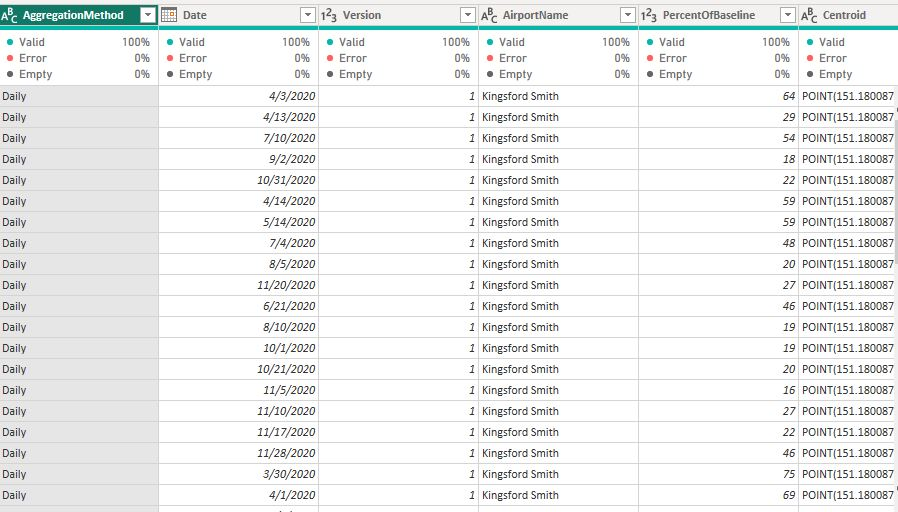
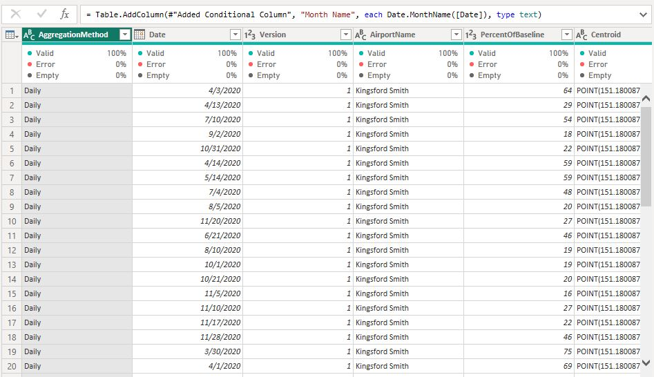
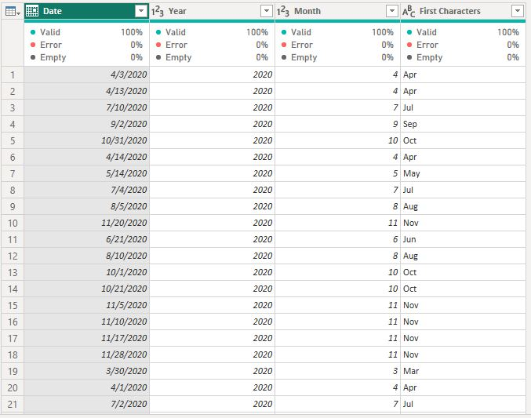
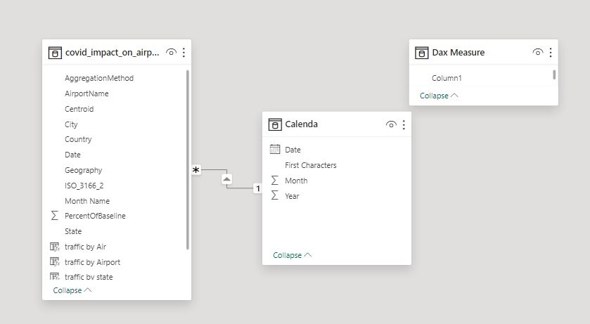
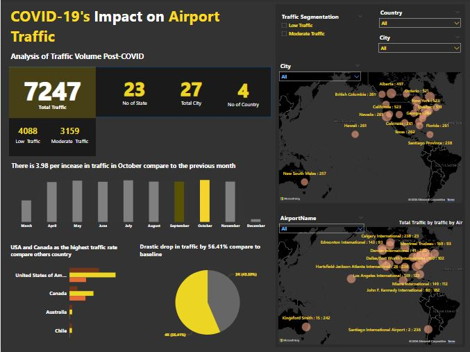

# COVID-19-s-Impact-on-Airport-Traffic-Analysis-of-Traffic-Volume-Post-COVID
This analysis is conducted to understand the significant decline in airport traffic due to the COVID-19 pandemic and to identify recovery trends. The insights gained will help improve airport operations and contribute to the economic stability of airline companies

Empty Airline Seats               |           Covid 19 impact
:--------------------------:|:------------------------:
          |         

# Project Overview
## Objective:
Analyze the dataset of over 5,000,000 commercial airline flights in 2015 to identify patterns in flight delays, cancellations, and airline reliability. This report will provide insights and recommendations based on the data.

# Specific Objectives:
- Determine how the overall flight volume varies by month and by day of the week.
- Calculate the percentage of flights that experienced departure delays in 2015 and the average delay time.
- Analyze the variation in delayed flights throughout the year, with a focus on flights departing from Boston (BOS).
- Identify the number of flight cancellations in 2015 and the reasons for these cancellations, including weather and airline-related issues.
- Evaluate which airlines are most and least reliable in terms of on-time departures.

Data Collection and  Preprocessing   | Inspect the dataset for missing values, inconsistencies, and anomalies. 
:-----------------------------------:|:------------------------:
                       |    

Calenda                      |        Data Modelling
:---------------------------:|:----------------------
             |     

# Approach to the Challenge
## Data Exploration and Analysis:
### Import and Explore the Dataset: Understand its structure and contents.
Data Cleaning and Transformation: Remove duplicates, handle missing values, and correct inconsistencies.
Create New Columns: Add columns for delay calculations, day of the week, and month.
### Initial Data Exploration:
Key Columns Identification: Focus on airline name, flight number, origin/destination airport, flight distance, scheduled/actual departure, and arrival times.
Replace Values: Clean up missing values and ensure consistency.
### Data Modelling:
Calendar Creation: Derive month, day, and year from the date data.
Baseline Comparison: Compare current traffic volume to the baseline period (February 1 to March 15, 2020).

# Baseline Comparison
## Percentage of traffic volume: This means the current traffic is compared to the traffic during the baseline period (February 1 to March 15, 2020).
How the percentage works:
•	If the current traffic volume is 50%, it means there is half as much traffic now compared to the baseline period or if is less an equal to 70% it means there is low traffic compare to the baseline
•	If the current traffic volume is less and equal to 100%, it means the traffic is moderate and the same now as it was during the baseline period.
•	If the current traffic volume is 200%, it means there is twice as much traffic now compared to the baseline period.
So, the percentage tells us how the current traffic level compares to what it was before COVID-19, using the baseline period as a reference.
 
Creation of additional conditional column to segment the low and moderate traffic

- Step 1: Identify the baseline traffic volume for the period from February 1 to March 15, 2020.
The baseline traffic volume from February 1 to march 15m, 2020 is 7247
- Step 2: Calculate the percentage change in traffic volume for each subsequent month compared to the baseline.
Answer is on the Dashboard

## Trend Analysis
- Step 1: Plot the monthly traffic volume percentages to visualize trends over time.
Initial Impact: There was a significant decline in airport traffic volume immediately following the onset of COVID-19, with the sharpest drops observed in April and May 2020.
- Step 2: Identify key periods of decline and recovery in traffic volume.
period of decline is around December while for recovery is starting from march to November
- Step 3: Analyze the impact of major COVID-19 events and policies (e.g., lockdowns, travel restrictions) on traffic volume.
Covid-19 event results to Low movement of People

## Geospatial Visualization
Geospatial Insights
•	Regional Differences: Certain regions showed quicker recovery rates, potentially due to domestic travel being less restricted compared to international travel.
•	Hotspots of Decline: Major international airports experienced the most significant declines, while smaller regional airports showed more resilience.
- Step 1: Use a geospatial visualization tool to create dynamic maps showing traffic changes.
- Step 2: Highlight airports with significant changes in traffic volume.
- Step 3: Create interactive features to explore traffic volume by month and region.
This can be view on the Dashboard

## Reporting and Insights
- Step 1: Summarize key findings from the trend analysis and geospatial visualization.
Answer is on the Dashboard
- Step 2: Discuss the implications of these findings for airport operations and planning.
Base on this data there will be low revenue generated and reduction in number of people traveling 
- Step 3: Provide recommendations for airport authorities and policymakers to manage future disruptions.
Adaptable Strategies: Airports should develop adaptable operational strategies to quickly respond to fluctuating travel demand.
Enhanced Safety Measures: Continued investment in health and safety measures to regain traveler confidence.
Diversification: Diversification of services and revenue streams to mitigate the impact of future disruptions.

Dashboard                    |        Report
:---------------------------:|:----------------------
             |     

    <a href="https://www.loom.com/share/d28b8a69b28144f289c19269f5386551">
      
Microsoft Power BI - Report Visualization - Watch Video

    </a>
    
  

## Conclusion
The COVID-19 pandemic has had a profound impact on airport traffic volumes, highlighting the need for resilient and flexible airport operations. This analysis provides valuable insights into traffic trends and offers recommendations for navigating future challenges. The dynamic geospatial visualization enhances the understanding of these trends and supports data-driven decision-making.
This report structure provides a comprehensive analysis framework, from data collection and preprocessing to trend analysis, geospatial visualization, and insights. It serves as a guideline to thoroughly understand and communicate the impact of COVID-19 on airport traffic volumes.

